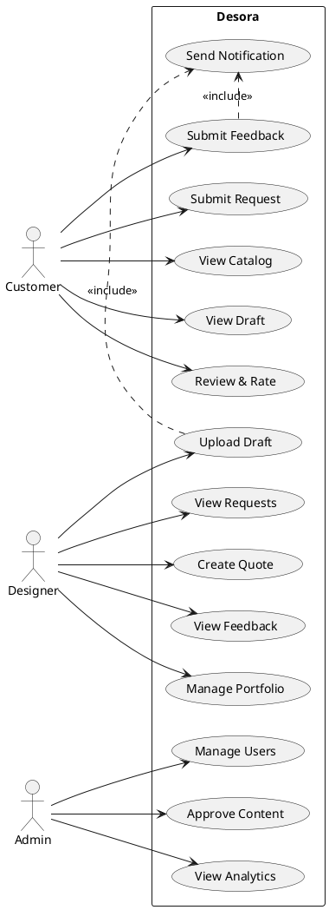
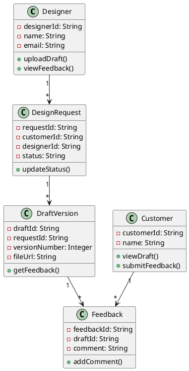
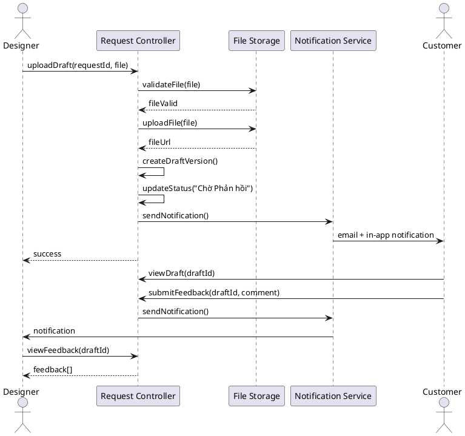

## 🎓 **ĐỒ ÁN MÔN HỌC: THIẾT KẾ HỆ THỐNG THƯƠNG MẠI ĐIỆN TỬ**

---

### **Trang bìa (Cover Page)**

* Tên môn học: *Thiết kế hệ thống Thương mại điện tử*
* Tên đề tài: *Thiết kế hệ thống Thương Mại điện tử cho Desora: Dịch vụ thiết kế theo yêu cầu của khách hàng*
* Nhóm sinh viên: Họ tên – MSSV
* Giảng viên hướng dẫn: …
* Ngày nộp: …

---

### Thông tin nhóm (Team Information)

| Thành viên | MSSV | Vai trò (Role)            | Chức năng phụ trách (Assigned Function) |
| ---------- | ---- | ------------------------- | --------------------------------------- |
| 1.         |      | Nhóm trưởng (Team Leader) | FR-03: Communication                    |
| 2.         |      | Thành viên (Member)       | FR-01: Request Management               |
| 3.         |      | Thành viên (Member)       | FR-02: Catalog Management               |
| 4.         |      | Thành viên (Member)       | FR-04: Review & Rating                  |

> *Nhóm gồm 4 sinh viên. Mỗi sinh viên chọn 1 Requirement cụ thể để thực hiện phân tích & thiết kế chi tiết.*

---

### **1. Giới thiệu (Introduction)**

#### **1.1. Lý do chọn đề tài**

Trong bối cảnh số hóa hiện đại, nhu cầu về dịch vụ thiết kế theo yêu cầu ngày càng tăng cao. Các doanh nghiệp, cá nhân và tổ chức thường xuyên cần các sản phẩm thiết kế chuyên nghiệp như logo, banner, website, bao bì sản phẩm, và nhiều loại hình thiết kế khác. Tuy nhiên, việc tìm kiếm và làm việc với các Designer phù hợp vẫn còn nhiều khó khăn:

* Khách hàng khó tìm được Designer có phong cách và kỹ năng phù hợp với nhu cầu
* Quy trình giao tiếp và chỉnh sửa giữa Khách hàng và Designer thiếu hệ thống, dễ gây hiểu lầm
* Thiếu nền tảng trung gian để quản lý yêu cầu, báo giá, thanh toán và đánh giá dịch vụ một cách minh bạch

**Desora** là một nền tảng Thương mại điện tử (E-commerce) chuyên biệt cho dịch vụ thiết kế theo yêu cầu, kết nối Khách hàng với các Designer chuyên nghiệp. Hệ thống cung cấp:

* **Giá trị cho Khách hàng**: Dễ dàng tìm kiếm và thuê Designer, theo dõi tiến độ dự án, giao tiếp trực tiếp và đánh giá chất lượng dịch vụ
* **Giá trị cho Designer**: Quản lý công việc hiệu quả, xây dựng portfolio, nhận phản hồi và phát triển danh tiếng
* **Giá trị cho nền tảng**: Tạo hệ sinh thái minh bạch, đáng tin cậy cho thị trường dịch vụ thiết kế

**Đối tượng người dùng**:
* **Khách hàng (Customer)**: Các cá nhân, doanh nghiệp cần dịch vụ thiết kế
* **Designer**: Các nhà thiết kế chuyên nghiệp cung cấp dịch vụ
* **Admin/Marketing**: Quản trị viên và nhân viên marketing quản lý hệ thống

#### **1.2. Mục tiêu nghiên cứu**

**Mục tiêu tổng quát:**
Nghiên cứu, phân tích và thiết kế hệ thống Thương mại điện tử Desora nhằm kết nối Khách hàng với Designer, hỗ trợ quy trình từ yêu cầu thiết kế đến hoàn thành dự án, đảm bảo tính minh bạch, hiệu quả và trải nghiệm người dùng tốt.

**Mục tiêu cụ thể:**
1. Phân tích yêu cầu người dùng và xác định các chức năng chính của hệ thống Desora
2. Thiết kế các mô hình Use Case, Class, Sequence, Activity Diagram để mô tả logic nghiệp vụ
3. Thiết kế cơ sở dữ liệu quan hệ (ERD) hỗ trợ các nghiệp vụ quản lý yêu cầu, báo giá, giao tiếp và đánh giá
4. Xây dựng giao diện người dùng (UI) thân thiện cho cả Khách hàng và Designer
5. Trình bày kiến trúc hệ thống (System Architecture) theo hướng Layered Architecture
6. Phát triển prototype website để demo các chức năng chính

#### **1.3. Phạm vi hệ thống**

**Phạm vi bao gồm:**
* Quản lý tài khoản người dùng (Khách hàng, Designer, Admin)
* Quản lý yêu cầu thiết kế và báo giá
* Quản lý danh mục Portfolio và Catalog
* Hệ thống giao tiếp và phản hồi giữa Khách hàng và Designer
* Hệ thống đánh giá và xếp hạng Designer
* Quản lý thanh toán và giao dịch
* Dashboard quản trị cho Admin
* Hệ thống khuyến mãi và phân tích

**Phạm vi không bao gồm:**
* Công cụ thiết kế trực tuyến (Designer sử dụng công cụ bên ngoài)
* Tích hợp với các nền tảng thanh toán phức tạp (chỉ mô phỏng)
* Hệ thống AI tự động thiết kế
* Ứng dụng mobile native (chỉ tập trung vào website)

#### **1.4. Cấu trúc báo cáo**

Báo cáo được chia thành các phần chính:
1. **Giới thiệu**: Lý do chọn đề tài, mục tiêu và phạm vi
2. **Phân tích yêu cầu**: Bài toán, yêu cầu chức năng và phi chức năng
3. **Mô hình hóa hệ thống**: Activity Diagram, Use Case Diagram, Class Diagram, Sequence Diagram
4. **Thiết kế hệ thống**: Kiến trúc, Database Design, UI/UX Design
5. **Demo & Báo cáo**: Prototype và màn hình demo
6. **Kết luận và hướng phát triển**
7. **Tài liệu tham khảo**

---

### **2. Phân tích yêu cầu (Requirement Analysis)**

#### **2.1. Mô tả bài toán (Problem Statement)**

**Vấn đề hiện tại:**
Thị trường dịch vụ thiết kế theo yêu cầu đang phát triển mạnh nhưng thiếu một nền tảng trung gian chuyên nghiệp để kết nối Khách hàng và Designer. Các vấn đề chính:

1. **Khó khăn trong tìm kiếm Designer**: Khách hàng phải tìm kiếm thủ công qua mạng xã hội, website cá nhân, không có tiêu chuẩn đánh giá rõ ràng
2. **Quy trình làm việc không chuẩn hóa**: Giao tiếp qua email, chat riêng lẻ, dễ mất thông tin, khó theo dõi tiến độ
3. **Thiếu minh bạch trong báo giá và thanh toán**: Không có cơ chế bảo vệ quyền lợi cho cả hai bên
4. **Khó quản lý Portfolio**: Designer khó thể hiện năng lực một cách có hệ thống

**Giải pháp đề xuất:**
Hệ thống Desora cung cấp nền tảng trung gian với các tính năng:
* **Quản lý yêu cầu tập trung**: Khách hàng gửi yêu cầu chi tiết, Designer xem và báo giá
* **Giao tiếp có hệ thống**: Chat, comment trên bản nháp, thông báo tự động
* **Quản lý tiến độ**: Trạng thái rõ ràng cho từng giai đoạn dự án
* **Đánh giá và xếp hạng**: Hệ thống đánh giá giúp xây dựng uy tín
* **Quản lý Portfolio**: Designer showcase tác phẩm, Khách hàng tham khảo trước khi quyết định

#### **2.2. Các yêu cầu chức năng (Functional Requirements)**

Dựa trên User Stories đã phân tích, hệ thống có các yêu cầu chức năng chính:

| ID    | Requirement                | Mô tả (Description)                                                                                    |
| ----- | -------------------------- | ------------------------------------------------------------------------------------------------------- |
| FR-01 | Request Management         | Quản lý yêu cầu thiết kế: Khách hàng gửi yêu cầu, Designer xem và báo giá, Admin theo dõi              |
| FR-02 | Catalog Management         | Quản lý danh mục Portfolio: Designer upload tác phẩm, Khách hàng xem và lọc, Admin duyệt nội dung     |
| FR-03 | Communication              | Hệ thống giao tiếp: Chat, comment trên bản nháp, thông báo tự động                                    |
| FR-04 | Review & Rating            | Đánh giá và xếp hạng: Khách hàng đánh giá Designer sau khi hoàn thành dự án                           |
| FR-05 | User Profile Management    | Quản lý hồ sơ người dùng: Thông tin cá nhân, lịch sử giao dịch, thống kê                              |
| FR-06 | Admin Interface            | Giao diện quản trị: Quản lý Designer, theo dõi yêu cầu, duyệt nội dung                                |
| FR-07 | Promotion Management       | Quản lý khuyến mãi: Tạo và quản lý mã giảm giá, chương trình khuyến mãi                               |
| FR-08 | Analytics & Reporting      | Phân tích và báo cáo: Thống kê yêu cầu, tỷ lệ chuyển đổi, hiệu suất Designer                          |
| FR-09 | Payment Processing         | Xử lý thanh toán: Thanh toán khi báo giá được chấp nhận, hoàn tiền nếu cần                             |
| FR-10 | Notification System        | Hệ thống thông báo: Email, in-app notification cho các sự kiện quan trọng                              |
| FR-11 | Automation                 | Tự động hóa: Gửi email tự động, cập nhật trạng thái, nhắc nhở                                         |

#### **2.3. Các yêu cầu phi chức năng (Non-functional Requirements)**

| ID     | Requirement      | Mô tả                                                                                    |
| ------ | ---------------- | ----------------------------------------------------------------------------------------- |
| NFR-01 | Performance      | Thời gian phản hồi dưới 2 giây cho các thao tác thông thường, upload file dưới 30 giây   |
| NFR-02 | Security         | Mã hóa dữ liệu người dùng, bảo mật thanh toán, xác thực 2 lớp cho tài khoản Designer     |
| NFR-03 | Availability     | Hệ thống hoạt động 24/7, uptime 99.5%, có cơ chế backup và recovery                      |
| NFR-04 | Scalability      | Hỗ trợ tối thiểu 10,000 người dùng đồng thời, có khả năng mở rộng theo nhu cầu           |
| NFR-05 | Usability        | Giao diện thân thiện, dễ sử dụng, hỗ trợ đa ngôn ngữ (Tiếng Việt, Tiếng Anh)            |
| NFR-06 | Compatibility    | Hỗ trợ các trình duyệt phổ biến (Chrome, Firefox, Safari, Edge), responsive cho mobile  |
| NFR-07 | Data Integrity   | Đảm bảo tính toàn vẹn dữ liệu, có cơ chế rollback khi có lỗi                             |
| NFR-08 | File Storage     | Hỗ trợ upload file thiết kế (JPG, PNG, PDF, AI, PSD) tối đa 50MB/file, tổng 5GB/user    |

---

### **3. Mô hình hóa hệ thống (System Modeling)**

> Mỗi sinh viên trong nhóm 4 người chọn **1 chức năng chính** để mô hình hóa đầy đủ. Phần này trình bày phân tích chi tiết cho **US-D04: Upload Draft & Receive Feedback** (FR-03: Communication).

#### **3.1. Biểu đồ hoạt động / BPMN (Activity Diagram / BPMN Diagram)**

**Quy trình: Designer Upload Draft & Customer Feedback**

Mô tả quy trình từ khi Designer tải lên bản nháp đến khi nhận phản hồi từ Khách hàng:

```
[Start] 
  ↓
[Designer đăng nhập vào hệ thống]
  ↓
[Designer chọn yêu cầu đang thực hiện]
  ↓
[Designer tải lên file bản nháp thiết kế]
  ↓
{File hợp lệ?}
  ├─ [No] → [Hiển thị lỗi: File không hợp lệ] → [End]
  └─ [Yes] → [Hệ thống lưu file và tạo version mới]
              ↓
              [Hệ thống cập nhật trạng thái: "Chờ Phản hồi"]
              ↓
              [Hệ thống gửi thông báo cho Khách hàng]
              ↓
              [Khách hàng nhận thông báo]
              ↓
              [Khách hàng xem bản nháp]
              ↓
              {Khách hàng có phản hồi?}
                ├─ [Có phản hồi] → [Khách hàng comment/phản hồi]
                                    ↓
                                    [Hệ thống gửi thông báo cho Designer]
                                    ↓
                                    [Designer xem phản hồi]
                                    ↓
                                    {Cần chỉnh sửa?}
                                      ├─ [Yes] → [Designer chỉnh sửa] → [Quay lại bước upload]
                                      └─ [No] → [Designer trả lời phản hồi]
                └─ [Chấp nhận bản nháp] → [Khách hàng approve]
                                            ↓
                                            [Hệ thống cập nhật trạng thái: "Đã Duyệt"]
                                            ↓
                                            [Hệ thống gửi thông báo cho Designer]
                                            ↓
[End]
```

**Các tác nhân tham gia:**
* **Designer**: Tải lên bản nháp, xem phản hồi, chỉnh sửa
* **Customer**: Xem bản nháp, phản hồi, approve
* **System**: Lưu file, gửi thông báo, cập nhật trạng thái

#### **3.2. Biểu đồ Use Case tổng thể (Use Case Diagram)**

**Use Case Diagram cho hệ thống Desora:**

```
                    ┌─────────────────┐
                    │   Desora System │
                    └─────────────────┘
                            │
        ┌───────────────────┼───────────────────┐
        │                   │                   │
        ▼                   ▼                   ▼
┌──────────────┐    ┌──────────────┐    ┌──────────────┐
│  Customer    │    │   Designer   │    │    Admin     │
└──────────────┘    └──────────────┘    └──────────────┘
        │                   │                   │
        │                   │                   │
   ┌────┴────┐         ┌────┴────┐         ┌────┴────┐
   │         │         │         │         │         │
   ▼         ▼         ▼         ▼         ▼         ▼
[Register] [Login] [Register] [Login] [Login] [Manage Users]
   │         │         │         │         │         │
   ▼         ▼         ▼         ▼         ▼         ▼
[Submit     [View     [View     [Create   [View     [Approve
 Request]   Catalog]  Requests] Quote]    Dashboard] Content]
   │         │         │         │         │         │
   ▼         ▼         ▼         ▼         ▼         ▼
[Upload     [Filter   [Upload   [Update   [Analytics] [Manage
 Files]     Designs]  Portfolio] Status]              Promotions]
   │         │         │         │
   ▼         ▼         ▼         ▼
[View       [Review   [Upload   [Receive
 Status]    & Rate]   Draft]    Feedback] ← US-D04
   │                   │         │
   ▼                   ▼         ▼
[Chat/      [View      [View
 Comment]   Feedback]  Comments]
```

**Use Case chi tiết: US-D04 - Upload Draft & Receive Feedback**

* **Actors**: Designer (Primary), Customer (Secondary), System
* **Includes**: "Validate File", "Send Notification", "Update Request Status"
* **Extends**: "View Feedback", "Edit Draft", "Approve Draft"

#### **3.3. Đặc tả Use Case (Use Case Specification)**

**Use Case: Upload Draft & Receive Feedback (US-D04)**

| Mục             | Nội dung                                                                                                                                    |
| --------------- | ------------------------------------------------------------------------------------------------------------------------------------------ |
| **Use Case ID** | UC-D04 / FR-03                                                                                                                             |
| **Use Case Name** | Upload Draft Design & Receive Customer Feedback                                                                                            |
| **Actors**      | **Primary**: Designer<br>**Secondary**: Customer, System                                                                                  |
| **Pre-conditions** | 1. Designer đã đăng nhập vào hệ thống<br>2. Designer đã có yêu cầu thiết kế với trạng thái "Báo giá được chấp nhận" hoặc "Đang Thiết kế"<br>3. Designer có quyền truy cập vào yêu cầu đó |
| **Post-conditions** | 1. File bản nháp được lưu vào hệ thống<br>2. Trạng thái yêu cầu được cập nhật thành "Chờ Phản hồi"<br>3. Khách hàng nhận được thông báo về bản nháp mới<br>4. Lịch sử version được ghi lại |
| **Main Flow**   | 1. Designer chọn yêu cầu thiết kế từ danh sách công việc của mình<br>2. Designer nhấn nút "Upload Draft"<br>3. Hệ thống hiển thị form upload file<br>4. Designer chọn file thiết kế (JPG, PNG, PDF, PSD, AI) và nhập mô tả (optional)<br>5. Designer nhấn "Submit"<br>6. Hệ thống validate file (kiểm tra định dạng, kích thước)<br>7. Hệ thống lưu file vào storage và tạo bản ghi DraftVersion trong database<br>8. Hệ thống cập nhật trạng thái Request thành "Chờ Phản hồi"<br>9. Hệ thống gửi thông báo email và in-app notification cho Customer<br>10. Hệ thống hiển thị thông báo thành công cho Designer<br>11. Customer nhận thông báo và xem bản nháp<br>12. Customer có thể comment/phản hồi trên bản nháp<br>13. Hệ thống gửi thông báo cho Designer khi có phản hồi mới<br>14. Designer xem phản hồi và quyết định chỉnh sửa hoặc trả lời |
| **Alternate Flow** | **A1: File không hợp lệ**<br>6a. Nếu file không đúng định dạng hoặc vượt quá kích thước cho phép<br>6b. Hệ thống hiển thị lỗi và yêu cầu Designer chọn file khác<br>6c. Quay lại bước 4<br><br>**A2: Customer approve bản nháp**<br>12a. Nếu Customer chấp nhận bản nháp<br>12b. Customer nhấn nút "Approve"<br>12c. Hệ thống cập nhật trạng thái thành "Đã Duyệt"<br>12d. Hệ thống gửi thông báo cho Designer<br>12e. Use Case kết thúc<br><br>**A3: Designer chỉnh sửa dựa trên phản hồi**<br>14a. Nếu Designer quyết định chỉnh sửa<br>14b. Designer tạo version mới (quay lại Main Flow bước 4) |
| **Exception Flow** | **E1: Lỗi upload file**<br>7a. Nếu quá trình upload file thất bại (mất kết nối, lỗi server)<br>7b. Hệ thống hiển thị thông báo lỗi<br>7c. Designer có thể thử lại<br><br>**E2: Storage đầy**<br>7a. Nếu storage của Designer đã đầy<br>7b. Hệ thống thông báo và yêu cầu xóa file cũ hoặc nâng cấp gói<br><br>**E3: Customer không phản hồi trong 7 ngày**<br>12a. Hệ thống tự động gửi email nhắc nhở Customer<br>12b. Nếu sau 14 ngày vẫn không phản hồi, hệ thống thông báo cho Designer và Admin |

#### **3.4. Biểu đồ lớp (Class Diagram)**

**Class Diagram cho chức năng Upload Draft & Receive Feedback:**

```
┌─────────────────────────────────────────────────────────────┐
│                        Designer                              │
│  - designerId: String                                        │
│  - name: String                                              │
│  - email: String                                             │
│  - portfolio: Portfolio[]                                    │
│  + uploadDraft(requestId, file, description): DraftVersion   │
│  + viewFeedback(draftId): Feedback[]                         │
│  + updateDraftStatus(draftId, status): void                  │
└─────────────────────────────────────────────────────────────┘
                            │
                            │ 1
                            │
                            ▼
┌─────────────────────────────────────────────────────────────┐
│                      DesignRequest                           │
│  - requestId: String (PK)                                    │
│  - customerId: String (FK)                                  │
│  - designerId: String (FK)                                  │
│  - title: String                                             │
│  - description: String                                       │
│  - status: RequestStatus                                     │
│  - createdAt: DateTime                                       │
│  - updatedAt: DateTime                                       │
│  + updateStatus(newStatus): void                             │
└─────────────────────────────────────────────────────────────┘
                            │
                            │ 1
                            │
                            ▼ *
┌─────────────────────────────────────────────────────────────┐
│                     DraftVersion                             │
│  - draftId: String (PK)                                      │
│  - requestId: String (FK)                                    │
│  - versionNumber: Integer                                    │
│  - fileUrl: String                                           │
│  - fileName: String                                          │
│  - fileSize: Long                                            │
│  - description: String                                       │
│  - uploadedAt: DateTime                                      │
│  - status: DraftStatus                                       │
│  + getFeedback(): Feedback[]                                 │
│  + approve(): void                                           │
└─────────────────────────────────────────────────────────────┘
                            │
                            │ 1
                            │
                            ▼ *
┌─────────────────────────────────────────────────────────────┐
│                        Feedback                              │
│  - feedbackId: String (PK)                                  │
│  - draftId: String (FK)                                      │
│  - customerId: String (FK)                                   │
│  - comment: String                                           │
│  - attachments: File[]                                       │
│  - createdAt: DateTime                                       │
│  - isApproved: Boolean                                       │
│  + addComment(text: String): void                            │
│  + attachFile(file: File): void                              │
└─────────────────────────────────────────────────────────────┘
                            │
                            │ 1
                            │
                            ▼
┌─────────────────────────────────────────────────────────────┐
│                      Customer                                │
│  - customerId: String                                        │
│  - name: String                                              │
│  - email: String                                             │
│  + viewDraft(draftId): DraftVersion                          │
│  + submitFeedback(draftId, comment): Feedback                │
│  + approveDraft(draftId): void                               │
└─────────────────────────────────────────────────────────────┘

┌─────────────────────────────────────────────────────────────┐
│                    NotificationService                       │
│  + sendEmailNotification(userId, type, data): void          │
│  + sendInAppNotification(userId, message): void             │
│  + createNotification(userId, type, content): Notification  │
└─────────────────────────────────────────────────────────────┘

┌─────────────────────────────────────────────────────────────┐
│                    FileStorageService                        │
│  + uploadFile(file: File, userId: String): String            │
│  + validateFile(file: File): Boolean                        │
│  + deleteFile(fileUrl: String): void                        │
│  + getFileUrl(fileId: String): String                       │
└─────────────────────────────────────────────────────────────┘
```

**Quan hệ giữa các lớp:**
* **Designer** → **DesignRequest**: Association (1-to-many) - Một Designer có nhiều yêu cầu
* **DesignRequest** → **DraftVersion**: Composition (1-to-many) - Một yêu cầu có nhiều version bản nháp
* **DraftVersion** → **Feedback**: Composition (1-to-many) - Một bản nháp có nhiều phản hồi
* **Customer** → **Feedback**: Association - Customer tạo phản hồi
* **NotificationService**: Dependency - Được sử dụng bởi các lớp khác
* **FileStorageService**: Dependency - Xử lý upload và lưu trữ file

#### **3.5. Biểu đồ trình tự (Sequence Diagram)**

**Sequence Diagram: Upload Draft & Receive Feedback**

```
Designer          DesignRequestController    FileStorageService    NotificationService    Customer
   │                         │                        │                      │                  │
   │ 1. uploadDraft()        │                        │                      │                  │
   │────────────────────────>│                        │                      │                  │
   │                         │                        │                      │                  │
   │                         │ 2. validateFile()      │                      │                  │
   │                         │───────────────────────>│                      │                  │
   │                         │                        │                      │                  │
   │                         │ 3. fileValid: true     │                      │                  │
   │                         │<───────────────────────│                      │                  │
   │                         │                        │                      │                  │
   │                         │ 4. uploadFile()        │                      │                  │
   │                         │───────────────────────>│                      │                  │
   │                         │                        │                      │                  │
   │                         │ 5. fileUrl: String     │                      │                  │
   │                         │<───────────────────────│                      │                  │
   │                         │                        │                      │                  │
   │                         │ 6. createDraftVersion()│                     │                  │
   │                         │────────────────────────┼──────────────────────┼──────────────────┤
   │                         │                        │                      │                  │
   │                         │ 7. updateStatus("Chờ Phản hồi")              │                  │
   │                         │────────────────────────┼──────────────────────┼──────────────────┤
   │                         │                        │                      │                  │
   │                         │ 8. sendNotification()  │                      │                  │
   │                         │───────────────────────>│                      │                  │
   │                         │                        │                      │                  │
   │                         │                        │ 9. sendEmail()       │                  │
   │                         │                        │─────────────────────>│                  │
   │                         │                        │                      │                  │
   │                         │                        │ 10. sendInApp()      │                  │
   │                         │                        │─────────────────────>│                  │
   │                         │                        │                      │                  │
   │ 11. success: DraftVersion│                       │                      │                  │
   │<─────────────────────────│                       │                      │                  │
   │                         │                        │                      │                  │
   │                         │                        │                      │                  │
   │                         │                        │                      │ 12. viewDraft()  │
   │                         │                        │                      │<─────────────────│
   │                         │                        │                      │                  │
   │                         │                        │                      │ 13. submitFeedback()│
   │                         │                        │                      │──────────────────>│
   │                         │                        │                      │                  │
   │                         │ 14. createFeedback()   │                      │                  │
   │                         │<───────────────────────│                      │                  │
   │                         │                        │                      │                  │
   │                         │ 15. sendNotification() │                      │                  │
   │                         │───────────────────────>│                      │                  │
   │                         │                        │                      │                  │
   │                         │                        │ 16. sendEmail()      │                  │
   │                         │                        │─────────────────────>│                  │
   │                         │                        │                      │                  │
   │ 17. viewFeedback()       │                        │                      │                  │
   │────────────────────────>│                        │                      │                  │
   │                         │                        │                      │                  │
   │ 18. feedback: Feedback[] │                        │                      │                  │
   │<─────────────────────────│                        │                      │                  │
```

---

### **4. Thiết kế hệ thống (System Design)**

#### **4.1. Kiến trúc hệ thống (System Architecture)**

**Mô hình kiến trúc: Layered Architecture (3-Tier)**

Hệ thống Desora được thiết kế theo mô hình **Layered Architecture** với 3 tầng chính:

```
┌─────────────────────────────────────────────────────────────┐
│                    Presentation Layer                       │
│  (Frontend - React/Vue.js)                                  │
│  - Customer Portal                                          │
│  - Designer Dashboard                                       │
│  - Admin Panel                                              │
└─────────────────────────────────────────────────────────────┘
                            │
                            ▼
┌─────────────────────────────────────────────────────────────┐
│                    Business Logic Layer                     │
│  (Backend API - Node.js/Express hoặc Laravel)               │
│  - Request Management Service                               │
│  - Communication Service                                    │
│  - Catalog Management Service                               │
│  - Review & Rating Service                                  │
│  - Notification Service                                     │
│  - File Storage Service                                     │
│  - Payment Service                                          │
└─────────────────────────────────────────────────────────────┘
                            │
                            ▼
┌─────────────────────────────────────────────────────────────┐
│                      Data Layer                              │
│  (Database - PostgreSQL/MySQL)                              │
│  - User Database                                            │
│  - Request Database                                         │
│  - File Storage (AWS S3 / Cloud Storage)                    │
│  - Notification Queue (Redis)                               │
└─────────────────────────────────────────────────────────────┘
```

**Mô tả các thành phần:**

1. **Presentation Layer (Frontend)**
   * **Customer Portal**: Giao diện cho Khách hàng - xem catalog, gửi yêu cầu, xem bản nháp, phản hồi
   * **Designer Dashboard**: Giao diện cho Designer - quản lý yêu cầu, upload draft, xem feedback
   * **Admin Panel**: Giao diện quản trị - quản lý users, duyệt nội dung, analytics

2. **Business Logic Layer (Backend API)**
   * **RESTful API** hoặc **GraphQL API** để giao tiếp giữa Frontend và Backend
   * Các service module độc lập, dễ bảo trì và mở rộng
   * Xử lý business logic, validation, authentication, authorization

3. **Data Layer**
   * **Relational Database** (PostgreSQL/MySQL) lưu trữ dữ liệu chính
   * **File Storage** (AWS S3, Google Cloud Storage) lưu trữ file thiết kế
   * **Cache** (Redis) cho session, notification queue
   * **Search Engine** (Elasticsearch - optional) cho tìm kiếm nâng cao

**Lý do chọn Layered Architecture:**
* Phù hợp với quy mô dự án đồ án (không quá phức tạp)
* Dễ phát triển và bảo trì
* Tách biệt rõ ràng giữa các tầng
* Có thể mở rộng thành Microservices sau này nếu cần

#### **4.2. Thiết kế cơ sở dữ liệu (Database Design)**

**ERD (Entity Relationship Diagram) - Các bảng chính:**

**Bảng Users:**
| Field        | Type         | Constraints | Description                |
| ------------ | ------------ | ----------- | -------------------------- |
| user_id      | VARCHAR(50)  | PK          | ID người dùng              |
| email        | VARCHAR(255) | UNIQUE, NN  | Email đăng nhập            |
| password     | VARCHAR(255) | NN          | Mật khẩu (hashed)          |
| full_name    | VARCHAR(100) |             | Họ tên                     |
| phone        | VARCHAR(20)  |             | Số điện thoại              |
| role         | ENUM         | NN          | Customer/Designer/Admin     |
| created_at   | TIMESTAMP    |             | Ngày tạo                   |
| updated_at   | TIMESTAMP    |             | Ngày cập nhật               |

**Bảng DesignRequests:**
| Field         | Type         | Constraints | Description                    |
| ------------- | ------------ | ----------- | ------------------------------ |
| request_id    | VARCHAR(50)  | PK          | ID yêu cầu                     |
| customer_id   | VARCHAR(50)  | FK → Users  | ID khách hàng                 |
| designer_id   | VARCHAR(50)  | FK → Users | ID designer (nullable)         |
| title         | VARCHAR(255) | NN          | Tiêu đề yêu cầu                |
| description   | TEXT         |             | Mô tả chi tiết                 |
| category      | VARCHAR(50)  |             | Loại thiết kế (Logo, Banner...)|
| budget        | DECIMAL(10,2)|             | Ngân sách dự kiến              |
| deadline      | DATE         |             | Hạn hoàn thành                 |
| status        | ENUM         | NN          | Trạng thái yêu cầu             |
| created_at    | TIMESTAMP    |             | Ngày tạo                       |
| updated_at    | TIMESTAMP    |             | Ngày cập nhật                   |

**Bảng Quotes:**
| Field         | Type         | Constraints | Description                    |
| ------------- | ------------ | ----------- | ------------------------------ |
| quote_id      | VARCHAR(50)  | PK          | ID báo giá                     |
| request_id    | VARCHAR(50)  | FK → DesignRequests | ID yêu cầu          |
| designer_id   | VARCHAR(50)  | FK → Users  | ID designer                    |
| price         | DECIMAL(10,2)| NN          | Giá đề xuất                    |
| estimated_days| INTEGER      |             | Số ngày dự kiến hoàn thành     |
| description   | TEXT         |             | Mô tả báo giá                  |
| status        | ENUM         | NN          | Pending/Accepted/Rejected      |
| created_at    | TIMESTAMP    |             | Ngày tạo                       |

**Bảng DraftVersions:**
| Field         | Type         | Constraints | Description                    |
| ------------- | ------------ | ----------- | ------------------------------ |
| draft_id      | VARCHAR(50)  | PK          | ID bản nháp                    |
| request_id    | VARCHAR(50)  | FK → DesignRequests | ID yêu cầu          |
| version_number| INTEGER      | NN          | Số phiên bản                   |
| file_url      | VARCHAR(500) | NN          | URL file trên storage          |
| file_name     | VARCHAR(255) |             | Tên file                       |
| file_size     | BIGINT       |             | Kích thước file (bytes)        |
| description   | TEXT         |             | Mô tả bản nháp                 |
| status        | ENUM         | NN          | Pending/Approved/Rejected      |
| uploaded_at   | TIMESTAMP    |             | Ngày upload                    |

**Bảng Feedbacks:**
| Field         | Type         | Constraints | Description                    |
| ------------- | ------------ | ----------- | ------------------------------ |
| feedback_id   | VARCHAR(50)  | PK          | ID phản hồi                    |
| draft_id      | VARCHAR(50)  | FK → DraftVersions | ID bản nháp            |
| customer_id   | VARCHAR(50)  | FK → Users  | ID khách hàng                  |
| comment       | TEXT         |             | Nội dung phản hồi              |
| is_approved   | BOOLEAN      |             | Đã duyệt chưa                  |
| created_at    | TIMESTAMP    |             | Ngày tạo                       |

**Bảng Portfolios:**
| Field         | Type         | Constraints | Description                    |
| ------------- | ------------ | ----------- | ------------------------------ |
| portfolio_id  | VARCHAR(50)  | PK          | ID portfolio                   |
| designer_id   | VARCHAR(50)  | FK → Users  | ID designer                    |
| title         | VARCHAR(255) | NN          | Tiêu đề tác phẩm               |
| image_url     | VARCHAR(500) | NN          | URL hình ảnh                   |
| category      | VARCHAR(50)  |             | Loại thiết kế                  |
| description   | TEXT         |             | Mô tả                          |
| is_approved   | BOOLEAN      |             | Đã được admin duyệt            |
| created_at    | TIMESTAMP    |             | Ngày tạo                       |

**Bảng Reviews:**
| Field         | Type         | Constraints | Description                    |
| ------------- | ------------ | ----------- | ------------------------------ |
| review_id     | VARCHAR(50)  | PK          | ID đánh giá                    |
| request_id    | VARCHAR(50)  | FK → DesignRequests | ID yêu cầu          |
| customer_id   | VARCHAR(50)  | FK → Users  | ID khách hàng                 |
| designer_id   | VARCHAR(50)  | FK → Users  | ID designer                    |
| rating        | INTEGER      | NN          | Điểm (1-5)                     |
| comment       | TEXT         |             | Nhận xét                       |
| created_at    | TIMESTAMP    |             | Ngày tạo                       |

**Mối quan hệ:**
* Users (1) → DesignRequests (N) - Một user có nhiều yêu cầu
* Users (1) → Portfolios (N) - Một designer có nhiều portfolio
* DesignRequests (1) → Quotes (N) - Một yêu cầu có nhiều báo giá
* DesignRequests (1) → DraftVersions (N) - Một yêu cầu có nhiều bản nháp
* DraftVersions (1) → Feedbacks (N) - Một bản nháp có nhiều phản hồi
* DesignRequests (1) → Reviews (1) - Một yêu cầu có một đánh giá

#### **4.3. Thiết kế giao diện, trải nghiệm người dùng (UI/UX Design)**

**Các giao diện chính cho chức năng US-D04:**

**1. Designer Dashboard - Upload Draft Page**
* **Layout**: Sidebar navigation + Main content area
* **Components**:
  * Danh sách yêu cầu đang thực hiện (Request List)
  * Form upload file với drag & drop
  * Preview area cho file đã upload
  * Text area để nhập mô tả bản nháp
  * Button "Upload Draft"
  * Lịch sử các version trước đó

**2. Customer View - Draft Review Page**
* **Layout**: Header + Main content + Sidebar (chat/comment)
* **Components**:
  * Image viewer với zoom, pan
  * Comment section bên cạnh hoặc overlay
  * Button "Approve" và "Request Changes"
  * Version history timeline
  * Notification badge

**3. Feedback Interface**
* **Components**:
  * Comment box với rich text editor
  * Attach file option (để khách hàng gửi reference)
  * Thread comments (reply to specific comments)
  * Markup tools (draw, highlight trên hình ảnh)

**User Flow:**
```
Designer Login
    ↓
Dashboard → Select Request
    ↓
Upload Draft Page
    ↓
[Upload File] → [Add Description] → [Submit]
    ↓
Success Notification
    ↓
Customer receives notification
    ↓
Customer views draft
    ↓
[Comment/Feedback] or [Approve]
    ↓
Designer receives notification
    ↓
Designer views feedback
    ↓
[Edit & Re-upload] or [Reply]
```

---

### **5. Demo & Báo cáo (Demo & Reporting)**

**Prototype Website - Các màn hình demo chính:**

1. **Homepage**: Giới thiệu Desora, showcase portfolio nổi bật
2. **Customer Portal**:
   * Đăng ký/Đăng nhập
   * Browse Catalog (Portfolio)
   * Submit Request Form
   * View Request Status
   * View Draft & Submit Feedback
3. **Designer Dashboard**:
   * View Requests
   * Create Quote
   * Upload Draft
   * View Feedback
   * Manage Portfolio
4. **Admin Panel**:
   * Manage Users
   * Approve Content
   * View Analytics

**Công nghệ đề xuất:**
* **Frontend**: React.js + Tailwind CSS hoặc Vue.js
* **Backend**: Node.js + Express hoặc Laravel (PHP)
* **Database**: PostgreSQL hoặc MySQL
* **File Storage**: AWS S3 hoặc Cloudinary
* **Deployment**: Vercel/Netlify (Frontend), Heroku/Railway (Backend)

---

### **6. Kết luận và hướng phát triển (Conclusion & Future Work)**

#### **6.1. Kết quả đạt được**

* ✅ Phân tích đầy đủ yêu cầu hệ thống với 11 Functional Requirements và 8 Non-functional Requirements
* ✅ Thiết kế Use Case Diagram tổng thể và đặc tả chi tiết cho US-D04
* ✅ Mô hình hóa quy trình nghiệp vụ bằng Activity Diagram và Sequence Diagram
* ✅ Thiết kế Class Diagram cho chức năng Upload Draft & Receive Feedback
* ✅ Thiết kế Database với ERD đầy đủ các bảng và quan hệ
* ✅ Đề xuất kiến trúc Layered Architecture phù hợp với quy mô dự án
* ✅ Thiết kế UI/UX cho các giao diện chính

#### **6.2. Đề xuất hướng phát triển**

**Ngắn hạn:**
* Phát triển prototype website với các chức năng cơ bản
* Tích hợp thanh toán trực tuyến (Stripe, PayPal, VNPay)
* Tối ưu hóa hiệu suất upload file lớn
* Cải thiện UX với real-time notification

**Trung hạn:**
* Phát triển ứng dụng mobile (React Native/Flutter)
* Tích hợp AI để gợi ý Designer phù hợp dựa trên yêu cầu
* Hệ thống chatbot tự động trả lời câu hỏi thường gặp
* Phân tích dữ liệu và báo cáo nâng cao

**Dài hạn:**
* Chuyển đổi sang kiến trúc Microservices để mở rộng quy mô
* Tích hợp công cụ thiết kế trực tuyến (Canvas editor)
* Ứng dụng Blockchain để bảo vệ bản quyền thiết kế
* Hệ thống đa ngôn ngữ và đa quốc gia

---

### **7. Tài liệu tham khảo (References)**

```
[1] Kenneth C. Laudon, Carol Traver, *E-Commerce 2024: Business, Technology, Society*, Pearson, 2024.

[2] UML Diagrams Tutorial, Visual Paradigm, 2023.
    https://www.visual-paradigm.com/guide/uml-unified-modeling-language/

[3] Shopify Architecture Overview – Shopify Engineering Blog.
    https://engineering.shopify.com/

[4] RESTful API Design Best Practices, REST API Tutorial, 2023.
    https://restfulapi.net/

[5] React.js Documentation, Meta Open Source, 2024.
    https://react.dev/

[6] Node.js Best Practices, GitHub, 2024.
    https://github.com/goldbergyoni/nodebestpractices

[7] Database Design Fundamentals, PostgreSQL Tutorial, 2023.
    https://www.postgresqltutorial.com/

[8] Microservices Architecture Patterns, Martin Fowler, 2023.
    https://martinfowler.com/articles/microservices.html
```

---

### **Phụ lục (Appendix)**

#### **A. PlantUML Code cho các biểu đồ**

**Use Case Diagram:**


**Class Diagram:**


**Sequence Diagram:**


#### **B. API Endpoints cho chức năng US-D04**

```
POST   /api/designers/{designerId}/requests/{requestId}/drafts
GET    /api/requests/{requestId}/drafts
GET    /api/drafts/{draftId}
POST   /api/drafts/{draftId}/feedback
GET    /api/drafts/{draftId}/feedback
PUT    /api/drafts/{draftId}/approve
DELETE /api/drafts/{draftId}
```

#### **C. Nhật ký làm việc nhóm**

| Tuần | Thành viên | Công việc thực hiện                    | Ghi chú |
| ---- | ---------- | -------------------------------------- | ------- |
| 1    | Tất cả     | Phân tích yêu cầu, User Stories        |         |
| 2    | SV1       | Phân tích FR-01: Request Management    |         |
| 2    | SV2       | Phân tích FR-02: Catalog Management    |         |
| 2    | SV3       | Phân tích FR-03: Communication (US-D04) |         |
| 2    | SV4       | Phân tích FR-04: Review & Rating       |         |
| 3    | Tất cả     | Thiết kế Database, Architecture        |         |
| 4    | Tất cả     | Vẽ biểu đồ UML, thiết kế UI/UX        |         |
| 5    | Tất cả     | Phát triển prototype                   |         |
| 6    | Tất cả     | Viết báo cáo, chuẩn bị demo            |         |

---

**Kết thúc báo cáo**

