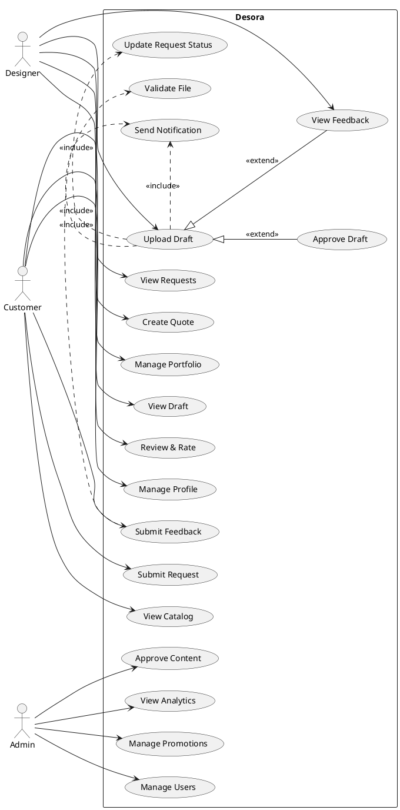
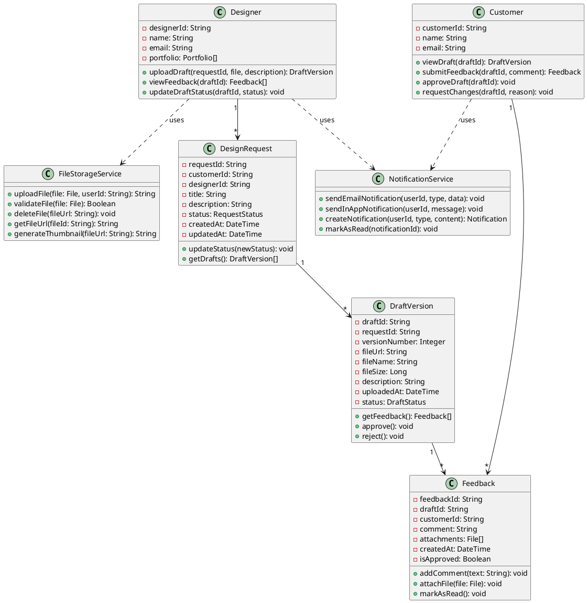
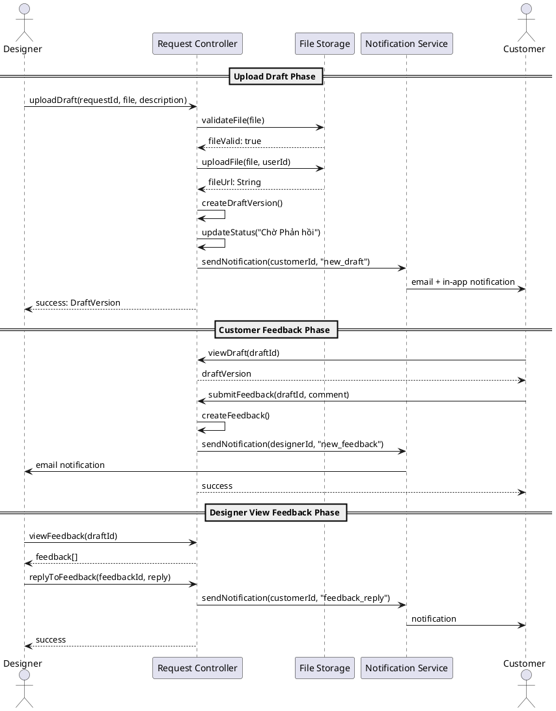
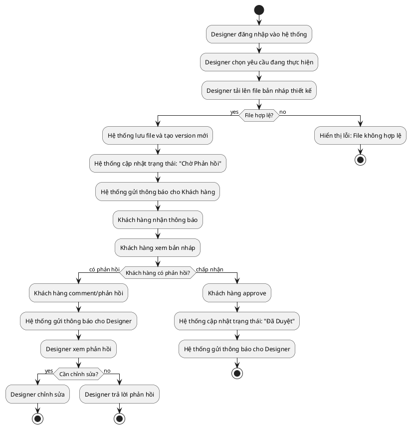

# **Phụ lục (Appendix)**

---

## **A. PlantUML Code cho các biểu đồ**

### **A.1. Use Case Diagram**



### **A.2. Class Diagram**



### **A.3. Sequence Diagram**



### **A.4. Activity Diagram**



---

## **B. API Endpoints cho chức năng US-D04**

### **B.1. Draft Management Endpoints**

```
POST   /api/designers/{designerId}/requests/{requestId}/drafts
GET    /api/requests/{requestId}/drafts
GET    /api/drafts/{draftId}
PUT    /api/drafts/{draftId}
DELETE /api/drafts/{draftId}
PUT    /api/drafts/{draftId}/approve
PUT    /api/drafts/{draftId}/reject
```

### **B.2. Feedback Endpoints**

```
POST   /api/drafts/{draftId}/feedback
GET    /api/drafts/{draftId}/feedback
GET    /api/feedback/{feedbackId}
PUT    /api/feedback/{feedbackId}
DELETE /api/feedback/{feedbackId}
POST   /api/feedback/{feedbackId}/reply
PUT    /api/feedback/{feedbackId}/read
```

### **B.3. Request Endpoints**

```
GET    /api/requests/{requestId}
PUT    /api/requests/{requestId}/status
GET    /api/requests/{requestId}/history
```

### **B.4. Notification Endpoints**

```
GET    /api/notifications
PUT    /api/notifications/{notificationId}/read
PUT    /api/notifications/read-all
DELETE /api/notifications/{notificationId}
```

### **B.5. File Upload Endpoints**

```
POST   /api/files/upload
GET    /api/files/{fileId}
DELETE /api/files/{fileId}
GET    /api/files/{fileId}/thumbnail
```

### **B.6. API Request/Response Examples**

#### **Upload Draft Request:**

```json
POST /api/designers/123/requests/456/drafts
Content-Type: multipart/form-data

{
  "file": <binary>,
  "description": "Version 1.0 - Initial design based on requirements",
  "version_number": 1
}
```

#### **Upload Draft Response:**

```json
{
  "success": true,
  "data": {
    "draft_id": "draft_789",
    "request_id": "456",
    "version_number": 1,
    "file_url": "https://storage.desora.com/drafts/draft_789.jpg",
    "file_name": "logo_design_v1.jpg",
    "file_size": 2048576,
    "status": "pending",
    "uploaded_at": "2024-12-15T10:30:00Z"
  },
  "message": "Draft uploaded successfully"
}
```

#### **Submit Feedback Request:**

```json
POST /api/drafts/789/feedback
Content-Type: application/json

{
  "comment": "Please change the color from red to blue and make the logo bigger",
  "attachments": ["https://storage.desora.com/ref/color_reference.jpg"]
}
```

#### **Submit Feedback Response:**

```json
{
  "success": true,
  "data": {
    "feedback_id": "feedback_101",
    "draft_id": "789",
    "customer_id": "customer_456",
    "comment": "Please change the color from red to blue...",
    "created_at": "2024-12-15T14:20:00Z",
    "is_read": false
  },
  "message": "Feedback submitted successfully"
}
```

---

## **C. Database Schema SQL (PostgreSQL)**

### **C.1. Users Table**

```sql
CREATE TABLE users (
    user_id VARCHAR(50) PRIMARY KEY DEFAULT gen_random_uuid()::text,
    email VARCHAR(255) UNIQUE NOT NULL,
    password VARCHAR(255) NOT NULL,
    full_name VARCHAR(100),
    phone VARCHAR(20),
    avatar_url VARCHAR(500),
    role VARCHAR(20) NOT NULL CHECK (role IN ('Customer', 'Designer', 'Admin')),
    is_verified BOOLEAN DEFAULT FALSE,
    is_active BOOLEAN DEFAULT TRUE,
    created_at TIMESTAMP DEFAULT CURRENT_TIMESTAMP,
    updated_at TIMESTAMP DEFAULT CURRENT_TIMESTAMP
);

CREATE INDEX idx_users_email ON users(email);
CREATE INDEX idx_users_role ON users(role);
```

### **C.2. DesignRequests Table**

```sql
CREATE TABLE design_requests (
    request_id VARCHAR(50) PRIMARY KEY DEFAULT gen_random_uuid()::text,
    customer_id VARCHAR(50) NOT NULL,
    designer_id VARCHAR(50),
    title VARCHAR(255) NOT NULL,
    description TEXT,
    category VARCHAR(50),
    budget DECIMAL(10,2),
    deadline DATE,
    status VARCHAR(50) NOT NULL,
    created_at TIMESTAMP DEFAULT CURRENT_TIMESTAMP,
    updated_at TIMESTAMP DEFAULT CURRENT_TIMESTAMP,
    FOREIGN KEY (customer_id) REFERENCES users(user_id) ON DELETE CASCADE,
    FOREIGN KEY (designer_id) REFERENCES users(user_id) ON DELETE SET NULL
);

CREATE INDEX idx_requests_customer ON design_requests(customer_id);
CREATE INDEX idx_requests_designer ON design_requests(designer_id);
CREATE INDEX idx_requests_status ON design_requests(status);
```

### **C.3. DraftVersions Table**

```sql
CREATE TABLE draft_versions (
    draft_id VARCHAR(50) PRIMARY KEY DEFAULT gen_random_uuid()::text,
    request_id VARCHAR(50) NOT NULL,
    version_number INTEGER NOT NULL,
    file_url VARCHAR(500) NOT NULL,
    file_name VARCHAR(255),
    file_size BIGINT,
    file_type VARCHAR(50),
    description TEXT,
    status VARCHAR(50) NOT NULL DEFAULT 'pending',
    uploaded_at TIMESTAMP DEFAULT CURRENT_TIMESTAMP,
    approved_at TIMESTAMP,
    FOREIGN KEY (request_id) REFERENCES design_requests(request_id) ON DELETE CASCADE,
    UNIQUE(request_id, version_number)
);

CREATE INDEX idx_drafts_request ON draft_versions(request_id);
CREATE INDEX idx_drafts_status ON draft_versions(status);
```

### **C.4. Feedbacks Table**

```sql
CREATE TABLE feedbacks (
    feedback_id VARCHAR(50) PRIMARY KEY DEFAULT gen_random_uuid()::text,
    draft_id VARCHAR(50) NOT NULL,
    customer_id VARCHAR(50) NOT NULL,
    comment TEXT NOT NULL,
    is_approved BOOLEAN DEFAULT FALSE,
    is_read BOOLEAN DEFAULT FALSE,
    created_at TIMESTAMP DEFAULT CURRENT_TIMESTAMP,
    updated_at TIMESTAMP DEFAULT CURRENT_TIMESTAMP,
    FOREIGN KEY (draft_id) REFERENCES draft_versions(draft_id) ON DELETE CASCADE,
    FOREIGN KEY (customer_id) REFERENCES users(user_id) ON DELETE CASCADE
);

CREATE INDEX idx_feedbacks_draft ON feedbacks(draft_id);
CREATE INDEX idx_feedbacks_customer ON feedbacks(customer_id);
CREATE INDEX idx_feedbacks_read ON feedbacks(is_read);
```

### **C.5. Notifications Table**

```sql
CREATE TABLE notifications (
    notification_id VARCHAR(50) PRIMARY KEY DEFAULT gen_random_uuid()::text,
    user_id VARCHAR(50) NOT NULL,
    type VARCHAR(50) NOT NULL,
    title VARCHAR(255) NOT NULL,
    message TEXT,
    link VARCHAR(500),
    is_read BOOLEAN DEFAULT FALSE,
    created_at TIMESTAMP DEFAULT CURRENT_TIMESTAMP,
    FOREIGN KEY (user_id) REFERENCES users(user_id) ON DELETE CASCADE
);

CREATE INDEX idx_notifications_user ON notifications(user_id);
CREATE INDEX idx_notifications_read ON notifications(is_read);
CREATE INDEX idx_notifications_created ON notifications(created_at DESC);
```

---

## **D. Nhật ký làm việc nhóm**

| Tuần | Thành viên | Công việc thực hiện                    | Ghi chú                                    |
| ---- | ---------- | -------------------------------------- | ------------------------------------------ |
| 1    | Tất cả     | Phân tích yêu cầu, User Stories        | Đã hoàn thành                              |
| 2    | SV1       | Phân tích FR-01: Request Management    | Activity Diagram, Use Case                 |
| 2    | SV2       | Phân tích FR-02: Catalog Management    | Class Diagram, Sequence Diagram           |
| 2    | SV3       | Phân tích FR-03: Communication (US-D04) | Tất cả biểu đồ UML                         |
| 2    | SV4       | Phân tích FR-04: Review & Rating       | Use Case Specification                     |
| 3    | Tất cả     | Thiết kế Database, Architecture        | ERD, System Architecture                   |
| 4    | Tất cả     | Vẽ biểu đồ UML, thiết kế UI/UX         | PlantUML, Figma mockups                   |
| 5    | Tất cả     | Phát triển prototype                   | React frontend, Node.js backend           |
| 6    | Tất cả     | Viết báo cáo, chuẩn bị demo            | Hoàn thiện tài liệu                        |

### **Phân công chi tiết:**

**SV1 - Nhóm trưởng (FR-03: Communication):**
* Phân tích chi tiết US-D04
* Vẽ tất cả biểu đồ UML cho chức năng Communication
* Viết Use Case Specification
* Thiết kế API endpoints

**SV2 (FR-01: Request Management):**
* Phân tích Request Management
* Activity Diagram cho quy trình request
* Class Diagram cho Request module

**SV3 (FR-02: Catalog Management):**
* Phân tích Catalog Management
* Sequence Diagram cho Portfolio upload
* UI/UX design cho Catalog browsing

**SV4 (FR-04: Review & Rating):**
* Phân tích Review & Rating
* Use Case cho Review process
* Database design cho Review table

---

## **E. Glossary (Thuật ngữ)**

| Thuật ngữ          | Định nghĩa                                                                 |
| ------------------ | -------------------------------------------------------------------------- |
| **Draft**          | Bản nháp thiết kế được Designer upload                                    |
| **Feedback**       | Phản hồi từ Customer về bản nháp                                          |
| **Portfolio**      | Tác phẩm mẫu của Designer để showcase                                     |
| **Quote**          | Báo giá từ Designer cho yêu cầu thiết kế                                  |
| **Request**        | Yêu cầu thiết kế từ Customer                                              |
| **Version**        | Phiên bản của bản nháp (v1.0, v2.0...)                                   |
| **Escrow**         | Hệ thống giữ tiền để bảo vệ cả hai bên                                    |
| **RBAC**           | Role-Based Access Control - Phân quyền dựa trên vai trò                   |
| **JWT**            | JSON Web Token - Token xác thực                                           |
| **CDN**            | Content Delivery Network - Mạng phân phối nội dung                        |

---

## **F. Checklist Hoàn thành**

### **Phân tích:**
- [x] User Stories đã được phân tích
- [x] Functional Requirements đã được xác định
- [x] Non-functional Requirements đã được xác định
- [x] Problem Statement đã được mô tả

### **Mô hình hóa:**
- [x] Activity Diagram cho US-D04
- [x] Use Case Diagram tổng thể
- [x] Use Case Specification cho US-D04
- [x] Class Diagram cho Communication module
- [x] Sequence Diagram cho Upload Draft & Feedback

### **Thiết kế:**
- [x] System Architecture (Layered Architecture)
- [x] Database Design (ERD)
- [x] UI/UX Design
- [x] API Endpoints

### **Tài liệu:**
- [x] Báo cáo đầy đủ các chương
- [x] PlantUML code
- [x] Database schema SQL
- [x] API documentation

---

**Trang trước**: [Chương 7 - Tài liệu tham khảo](07-Tai-Lieu-Tham-Khao.md) | **Về đầu**: [Trang bìa](00-Trang-Bia.md)

